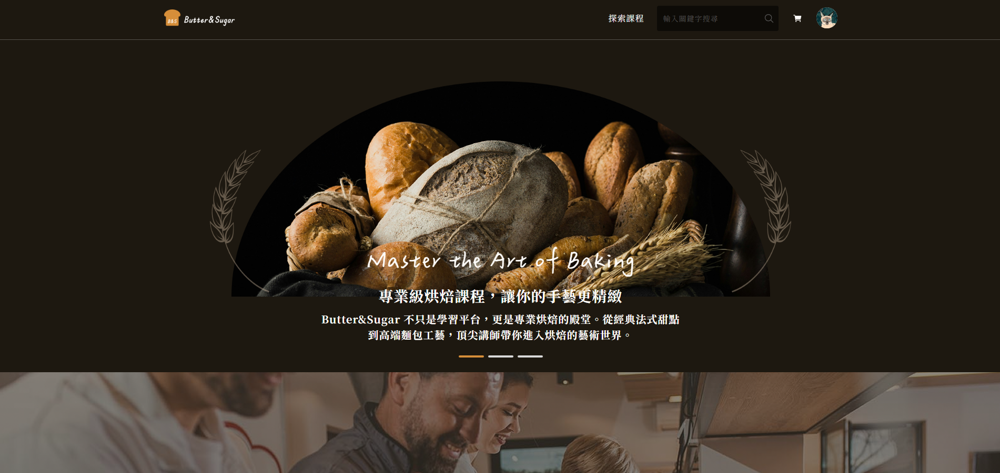

# Butter & Sugar

這是一個烘焙領域的線上課程平台，功能包含前台使用者的課程瀏覽、購買、提問，後台使用者的課程上傳、新增、編輯、問題回覆等。

## 專案預覽



Demo: https://buttersugar-frontend.zeabur.app/Home

## 功能特色

- 前台使用者：
  - 課程瀏覽、搜尋與分類
  - 加入購物車、下單購買
  - 提問與回覆、課程評價
- 後台講師：
  - 課程上傳、編輯與刪除
  - 回覆學員提問
- 管理者功能（未來擴充）：
  - 管理講師、使用者與訂單

## 登入機制說明

本專案使用第三方登入（Google OAuth）進行使用者身分驗證，無須註冊帳號，開發或測試時請使用具有授權權限的 Google 帳戶登入。

## 技術架構

- node.js版本:v22.14.0
- Vue3 + Vite
- Pinia狀態管理
- UnoCSS + Naive
- TypeScript
- Axios 串接API

## 專案安裝

1.Clone 本專案

git clone https://github.com/HatchiX8/Butter-Sugar-Frontend.git

2.安裝套件

npm install

3.啟動開發伺服器

npm run dev

## 開發與部署指令

- 開發模式：`npm run dev`
- 打包專案：`npm run build`
- 預覽建置結果：`npm run preview`
- 檢查格式：`npm run lint`

## 專案結構說明

```
src/
├── assets/         # 靜態資源（圖示、圖片等）與 CSS 樣式
├── components/     # 共用元件
├── views/          # 各頁面資料夾
├── router/         # Vue Router 設定
├── stores/         # Pinia 狀態管理
├── types/          # 共用 TypeScript 型別
├── App.vue         # 入口頁面
└── main.ts         # 專案進入點
```

## 開發流程（Git Flow）

1. 每位開發者以 `feature/你的名稱` 建立分支進行開發
2. 開發完成後發送 Pull Request 至 `dev` 分支
3. 經 Review 無誤後合併進 `main` 進行部署
